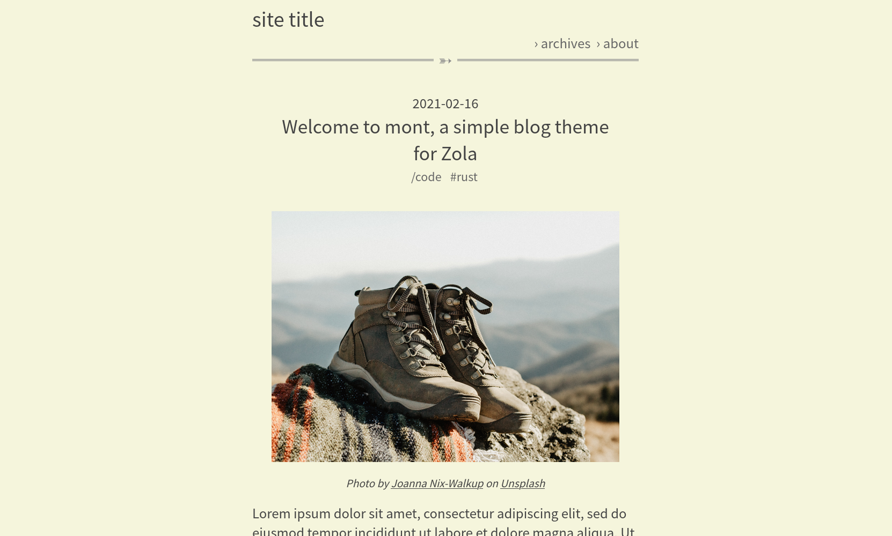

# mont

A simple blog theme for Zola.



Features:

- simple & clean
- 10 articles (paginated) in `index.html` so that you don't need to click the article title.
- MathJax support

Demo site: [https://mont-zola-theme.netlify.app/](https://mont-zola-theme.netlify.app/)

## Usage

```
cd YOUR_SITE_DIRECTORY/themes
git clone https://github.com/kyoheiu/mont.git
```

and set the theme-name in `config.toml` to `mont`.

```
theme = "mont"
```

## How to customize

- Pagination: Change the number of `paginate_by` in `posts/_index.md`. Default is 10.
- Horizontal rule mark: Change `mark` variable in `sass/main.scss`. Default is `➳`.
